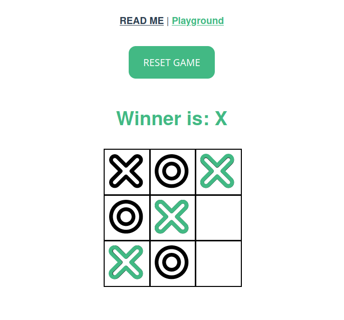

# Tic tac toe - with Vue.js
This is a simple web app to play the popular game [Tic tac toe](https://en.wikipedia.org/wiki/Tic-tac-toe)

It was made as a project for the Vue.js curriculum at [start2impact](https://www.start2impact.it/)

You can play the game here:

🎲 [Play here](https://vue-tictactoe-byemmanuele.netlify.app/#/) 🎲

### Preview

## Contact
You can find me here:

IG: [@emmanuele.online](https://www.instagram.com/emmanuele.online/)

Personal Page: [www.emmanuele.xyz](htpps://www.emmanuele.xyz)